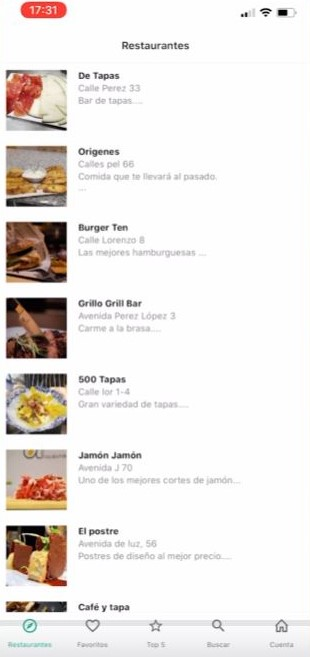
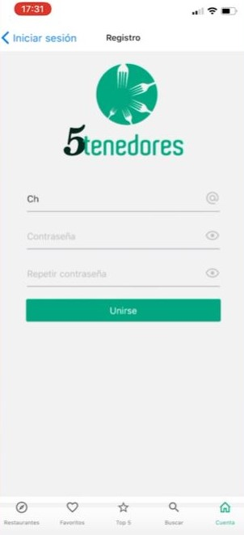
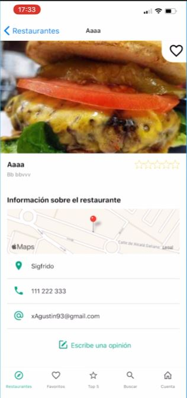

# React Native Expo: App Restaurantes realizada con React Hooks, React Native, Firebase 

_Proyecto completo desarrollado con React Native. La app cuenta con un sistema de login con auth de firebase, un panel de usuario editable, un listado de restaurantes con su respectiva ubicacion en el maps, un buscador y un sistema de rankings por calificacion._

## Herramientas utilizadas:

- React Hooks
- React Native
- React Native Navigation
- Native Base
- Firebase
- Expo

## Pasos a seguir:

- Para comenzar dentro del directorio de la app, ejecute:
`yarn`

- luego ejecute:
`yarn start`

- En su ventana web de localhost, seleccione "run in web":

- En la carpeta firebase (del proyecto restaurantcliente) modifique el archivo: por sus propias credenciales.

## Vista Previa de la App:

